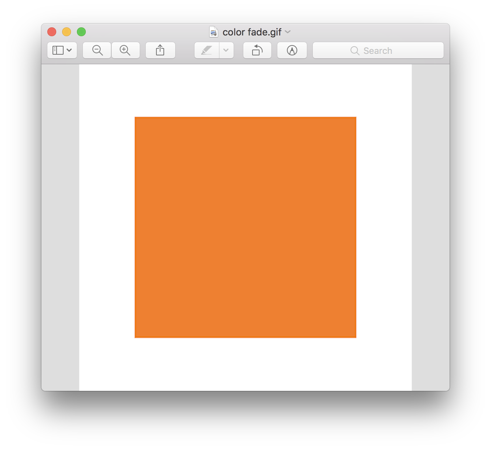
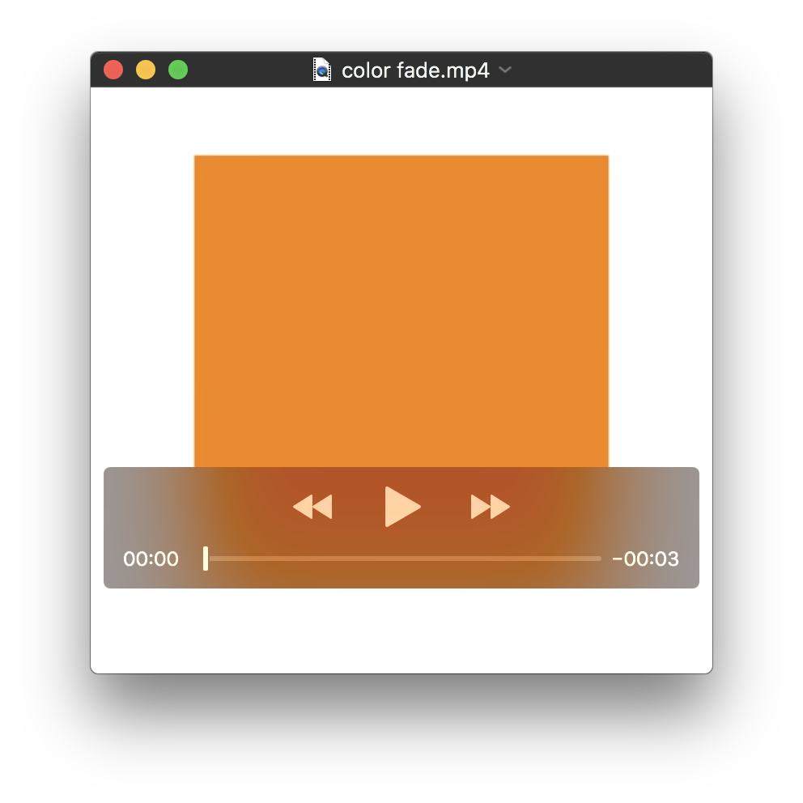
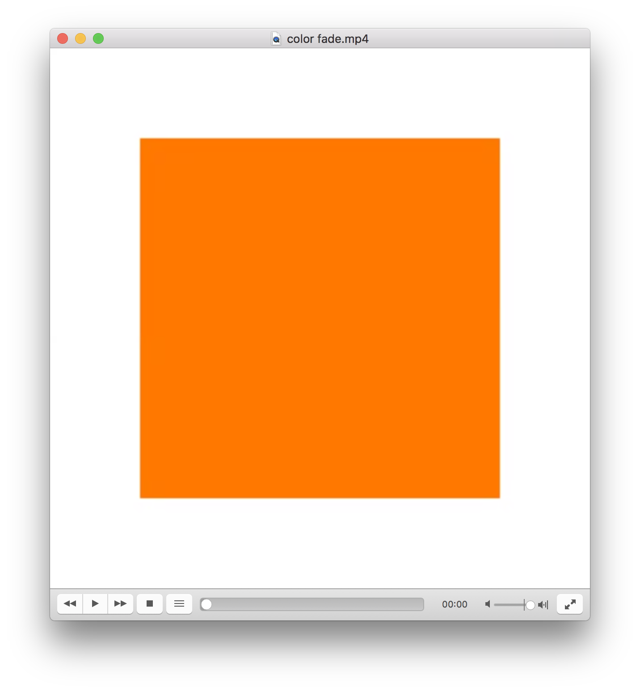
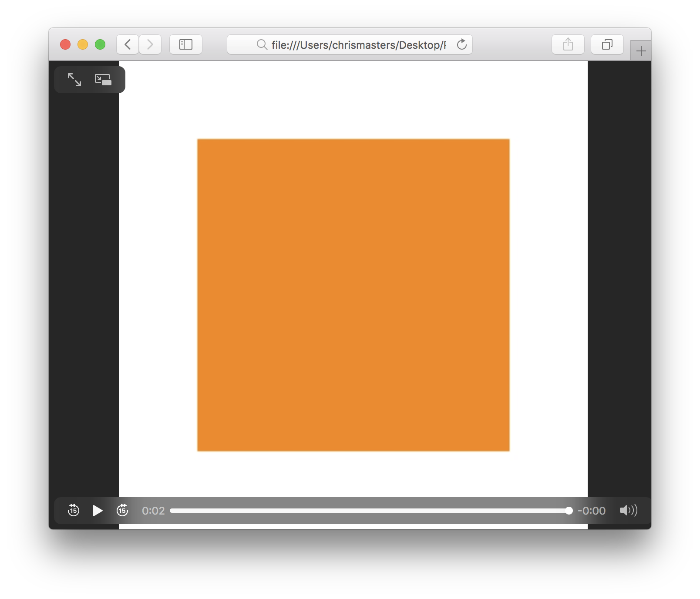
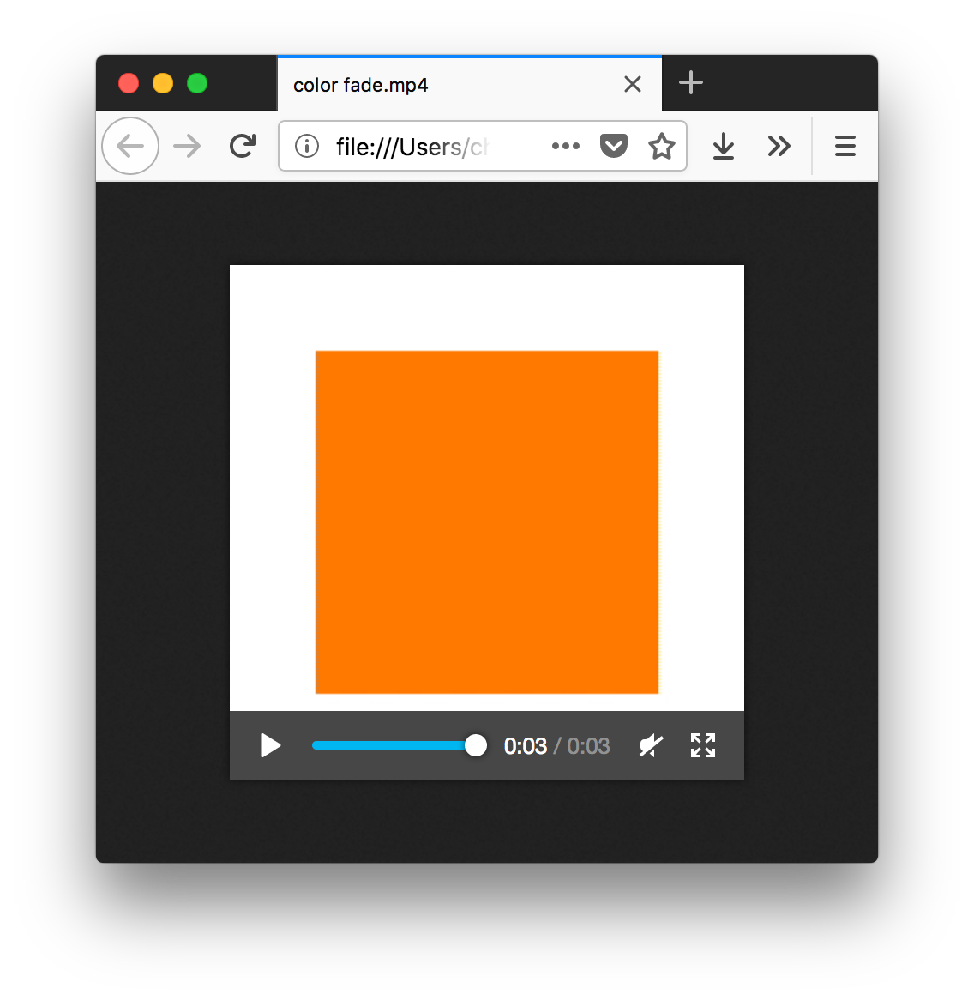

# Video Color Test

This color issue occurs when exporting video from After Effects, Screenflow and also Principle.

Simply put, depending on the application it is viewed in the video is either too washed out or too saturated.

## Example using Principle

These two exports from Principle illustrate the issue.

The original color is a simple rectangle with a hex of **#FF7900**

For measuring the values I've used the Digital Color Meter, testing native values and sRGB.

### Export test of GIF image

Here is the original exported `gif` from the application.


#### Preview



Color seems to match accurately the original color.

- native values: **#EE8031**
- sRGB: **#FF7900**

### Export test of MP4 video

In contrast to the consistent color of the `gif` the `mp4` has significant color shift which varies between applications.

#### Quicktime Player



Color appears much more washed out.

- native values: **#EA8B31**
- sRGB: **#F98600**

#### VLC



Color saturation seems boosted.

- native values: **#FF7800**
- sRGB: **#FF6E00**

#### Chrome


Color appears more washed out.

- native values: **#EA8B31**
- sRGB: **#F98600**

#### Safari



Color appears more washed out.

- native values: **#EA8B31**
- sRGB: **#F98600**

#### Firefox



Color saturation seems boosted.

- native values: **#FF7800**
- sRGB: **#FF6E00**

### Results

The colors appear either washed out or slightly oversaturated, depending on the application.

Here is also an FFMPEG output of all the video information.

```
Input #0, mov,mp4,m4a,3gp,3g2,mj2, from 'color_fade.mp4':
  Metadata:
    major_brand     : mp42
    minor_version   : 1
    compatible_brands: mp41mp42isom
    creation_time   : 2018-09-24 11:40:55
  Duration: 00:00:02.95, start: 0.000000, bitrate: 48 kb/s
    Stream #0:0(und): Video: h264 (High) (avc1 / 0x31637661), yuv420p(tv), 300x300 [SAR 1:1 DAR 1:1], 40 kb/s, 60 fps, 60 tbr, 600 tbn, 1200 tbc (default)
    Metadata:
      creation_time   : 2018-09-24 11:40:55
      handler_name    : Core Media Video
```

### Solutions

Trying to investigate the cause online there are some suggestions that it could be something to do with the export format (and possible gamma tags).

[Brightness Issues with H.264 QuickTime Movies](https://www.provideocoalition.com/brightness_issues_with_h264_quicktime_movies/)

[The QuickTime Gamma Bug](https://vitrolite.wordpress.com/2010/12/31/quicktime_gamma_bug/)

None of this seems to resolve the issue though.
